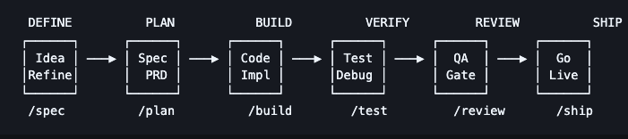
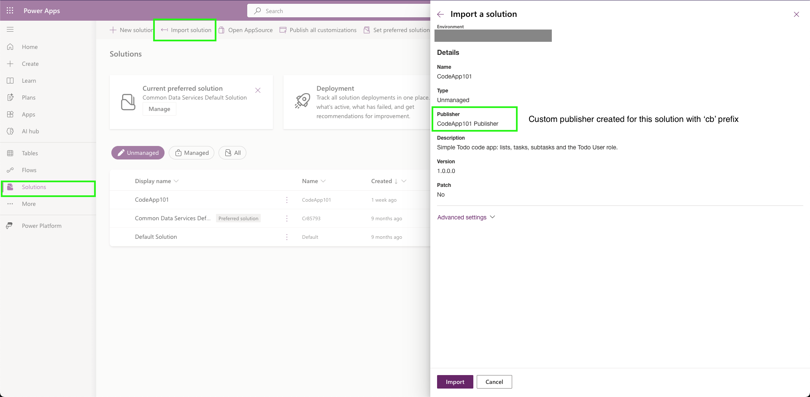
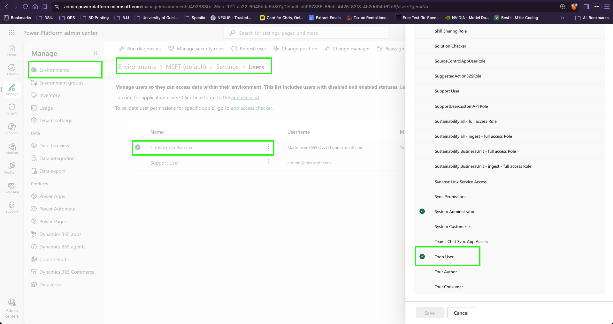
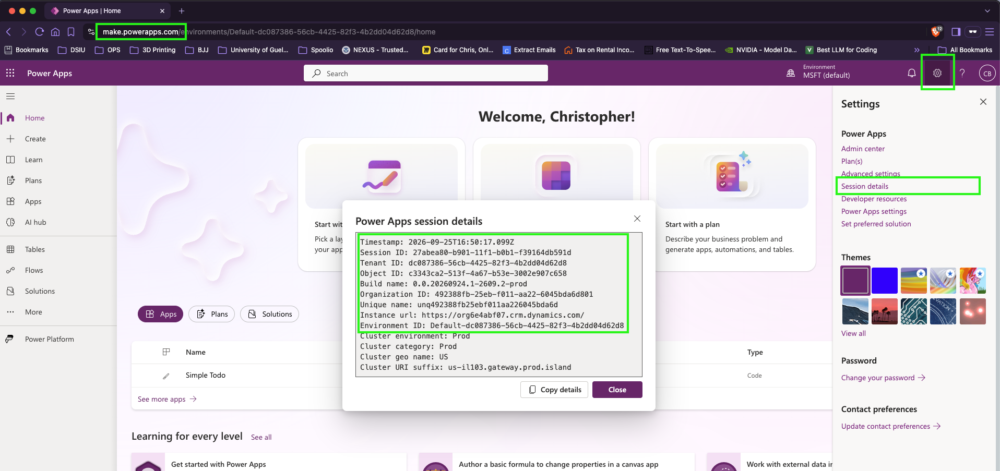
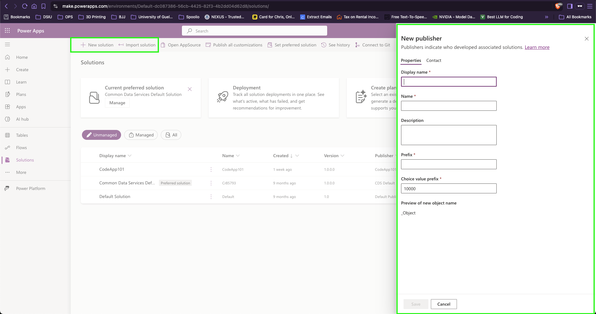

# How to build a Power Apps code app with React, Dataverse and the Power Apps CLI

*Christopher Barrow · Senior Manager, [AccelerateON][accelerateon] enterprise service · Enterprise Fintech Practice · I&IT Enterprise Solutions Division*

---

## Overview

Power Apps **code apps** let you write an ordinary React single-page application, deploy it into a Power Platform environment, and apply Microsoft Entra authentication, Dataverse access and [AccelerateON governance][accelerateon-governance] policies without building any of it yourself. You keep full control of the UI. The platform handles identity, hosting and data.

This article is a step-by-step guide built around one such app: a sample personal todo list with multiple lists, due dates and reminders, recurring tasks, subtasks and a Today view. It stores everything in three custom Dataverse tables and runs in a browser on phone, tablet and desktop. The article covers how the app was planned. It then takes you from a copy of the repository to the app running on your machine against your own Dataverse tables. Finally, it takes you to a published app that your colleagues can open.

**Who this is for.** Developers comfortable with React and TypeScript who have not shipped a Power Platform code app before. No low-code experience is assumed. Power Platform administrators will find the environment and permission sections useful on their own.

**Where this build ran, and why it matters.** Everything below was done in a personal Microsoft 365 developer tenant, in a Power Platform environment with no data loss prevention policies, no environment group rules, no Managed Environment controls and no conditional access. Every setting was mine to change and every connector was available.

That is not where teams in the OPS work. In our corporate OPS tenant the same steps may run into governance controls that are working exactly as intended. The fix is then a conversation with the [AccelerateON team][accelerateon-team], and perhaps a consultation with ITOD or cyber, rather than a change you make yourself. [Working in the OPS governed tenant](#working-in-the-ops-governed-tenant) names each control, says where it may bite, and gives you the specific ask to raise.

**What this article covers:**

| Part | Scope |
|---|---|
| 1 | Plan the app and set up Dataverse: specification, schema, solution import, security role |
| 2 | Run the app on your machine: clone, sample data, connect to your environment, Local Play |
| 3 | What the app does: the features, in brief |
| 4 | Publish and share: build, push, share, assign the role, smoke test |
| 5 | Change the app and publish it again: fork, branch, test-first edit, commit, build, push |

Each part ends with a short **Verify** section. Finish it before you start the next part.

**Where to run the commands.** Type every command in this article into a terminal. That can be Terminal on macOS, PowerShell on Windows, the terminal within an AI coding harness such as Claude Code, Codex or OpenCode, or the terminal built into Visual Studio Code (**Terminal → New Terminal**). Unless a step says otherwise, run commands in the repository root, the folder that contains `package.json`.

Each step says where to run its commands. The Power Apps CLI does not have its own window or shell. It is installed with the project, and you run it in the same terminal by starting the command with `npx pa`. Steps done in a browser name the site: the maker portal, [make.powerapps.com](https://make.powerapps.com), or the admin center, [admin.powerplatform.microsoft.com](https://admin.powerplatform.microsoft.com).

**A note on terminology.** Two different command-line tools sound alike. `pac` is the older .NET Power Platform CLI, distributed as an MSI on Windows and through a Visual Studio Code extension elsewhere. `pa` is the newer npm-based Power Apps CLI that became generally available in August 2026 and replaced the `pac code` command group entirely.

Code apps use `pa`. Because it is an npm package, it runs anywhere Node.js does, including macOS, with no extension required. Articles written before mid-2026 show `pac code` commands that no longer exist. Some earlier walkthroughs, including the video in [Related information](#related-information), run `npx power-apps init` and `npx power-apps push` instead. The version of `@microsoft/power-apps` this repository installs has no such command, so use the `npx pa app …` forms shown here.

**Known limitations worth reading before you commit to code apps.** Code apps do not run in the Power Apps mobile player, so mobile means a mobile browser. They do not support Power Platform Git integration, SharePoint forms integration, or Power BI data integration. There is no offline mode and no push notification channel. None of these blocked this project, but any one of them could block yours.

---

## Prerequisites

### Licensing and security roles

- A [Power Apps Per User licence][pa-per-user] for every user who will develop or run the finished app.
- The **System Administrator** security role assigned to users within the target Power Platform environment. Importing a solution creates tables, and table creation requires it. Most developers building code apps already hold this role, so this is usually a box already ticked rather than a step.

### Environment

- A dedicated Power Platform DEV, UAT or PROD environment provisioned with Dataverse and managed through [AccelerateON][accelerateon-request].
- **Code apps enabled** in that environment. A user with the System Administrator role can turn this on at [admin.powerplatform.microsoft.com](https://admin.powerplatform.microsoft.com) under Manage → Environments → *your environment* → Settings → Product → Features → **Enable code apps**.

### Working in the OPS governed tenant

In a corporate managed tenant such as the OPS, several controls may sit between you and a running code app. None of them is a defect. They exist to keep data where it belongs, and the delay they introduce is usually the approval, not the technical change.

In the OPS these requests go to **AccelerateON**, the enterprise service that manages Microsoft Power Platform and delivers robotic process automation. If you run into one of these controls, raise it with AccelerateON early.

AccelerateON is also worth talking to before you decide on a code app at all. A good deal of what people reach for a custom React app to do is already solved by a canvas app or a Power Automate flow. A code app is the right answer when you genuinely need custom UI, custom logic or a component model that low code cannot express. It is the wrong answer when it is chosen out of unfamiliarity with what the platform already offers.

| Control | Where it stops you | What to ask for |
|---|---|---|
| **Code apps not enabled on the environment** | The very first `pa app init`, and every import. It is an explicit per-environment toggle that defaults to off | Code apps enabled on the named environment. Ask a user with the System Administrator role to enable this feature |
| **Data loss prevention (DLP) policy** | Enforced when the app launches, not when you write the code. An app built against a blocked connector will pass every local test and fail for real users | A lightweight cyber assessment of the connectors your app needs. Contact AccelerateON to facilitate this assessment with cyber. Ask about the connectors before you build the integration, not after |
| **Conditional Access** | Sign-in fails for users on unmanaged devices or from certain locations | Confirmation of which policies apply to Power Platform, so you test appropriately |
| **Power Apps licensing** | Every end user needs a Power Apps Per User licence to run and use a code app | Self-request licences for your team via OnRequest. For bulk requests of more than 50 licences, reach out to the AccelerateON team |
| **Power Automate licensing** | A flow that runs outside the app, on a schedule or from an external trigger, is not covered by the app's licence. Nor are premium connectors | Self-request [Power Automate Premium via OnRequest][onrequest-pa-premium] for the flow owner, where the flow runs standalone or touches a premium connector |
| **Entra app registration for automated deployment** | Publishing from a pipeline needs a service principal, and creating app registrations is managed by the ITOD Go Cloud team | A service principal via an ITOD [WIA request][wia-request] with the environment access it needs, plus `edit` access on the app once it exists. Only needed for CI/CD, so it can follow the first manual deploy |

### Local tooling

- Node.js 22 or later, which the Power Apps CLI requires. Check yours with `node --version` in a terminal. Version 24 LTS was used here.
- Git, and a [GitHub](https://github.com) account. Part 5 pushes your changes to your own fork of the repository.
- A code editor or AI coding harness. Visual Studio Code works well, because its terminal opens in the project folder.
- About 250 MB of disk for the Playwright browsers, only if you run the end-to-end tests.
- Python 3, only if you change the Dataverse schema and need to regenerate the solution package.

The Power Apps CLI needs no separate install. It is a development dependency of this repository, so `npm install` in Step 6 installs it and `npx pa` runs it. At the time of writing, `npx pa --version` reports `1.0.2`.

---

## Procedure

### Part 1 · Plan the app and set up Dataverse tables

> **Want to see the app first?** Steps 6 and 7 need no Power Platform access at all. Do them first to have the app running on your machine with sample data in a couple of minutes, then come back here.

Full disclosure: this app was vibe-coded with Claude Code, but that doesn't mean the build had no structure. Standard software engineering practices from [agent-skills][agent-skills] were added to Claude to help build this app:



These skills for AI coding agents such as Claude Code encode the workflows, quality gates and best practices that senior engineers use when building software.

#### Step 1: Write the specification before any code

The specification for this build covered six areas, which is a useful minimum for any project built with an AI coding agent:

1. **Objective**: what is being built, for whom, and what success looks like in measurable terms.
2. **Tech stack**: every dependency with a version and a one-line justification.
3. **Commands**: the full executable command for build, test, lint, dev and deploy. Not "run the tests" but the exact string.
4. **Project structure**: where each kind of file lives.
5. **Code style**: one real code sample beats three paragraphs of description.
6. **Boundaries**: three tiers: always do, ask first, never do.

The result lives at [`SPEC.md`](../SPEC.md) in the repository root, in version control alongside the code, updated in the same pull request whenever a decision changes.

#### Step 2: Break the specification into ordered, verifiable tasks

The plan Claude produced slices the work **vertically**. Rather than building all the data access, then all the UI, each task after the foundation delivers one complete user-visible capability: the schema it needs, the data calls, the components and the tests. Every task leaves the application in a working state.

Seventeen tasks were produced, each with acceptance criteria, a verification command, its dependencies and the files it is expected to touch. Any task that would touch more than about five files was split.

The single most valuable structural decision in the plan was a **repository interface** between the application and Dataverse. Every component talks to the interface and never to Dataverse directly. That is why fifteen of the seventeen tasks were built and tested with no Dataverse connection at all, and why generated column names such as `cb_duedate` never reach the React components. Step 8 shows where it lives.

The plan and task list are at [`tasks/plan.md`](../tasks/plan.md) and [`tasks/todo.md`](../tasks/todo.md).

#### Step 3: Define the Dataverse schema as code

Dataverse tables are normally created by clicking through a Power Platform maker portal such as [make.powerapps.com](https://make.powerapps.com). That works, but the schema then exists only in the environment where it was created. It cannot be diffed, reviewed in a pull request, or recreated in a second environment without repeating every click.

The alternative is an **unmanaged solution package**: a zip of three XML files that you import. In this build a Python script, [`solution/generate.py`](../solution/generate.py), writes those files and zips them. The script is the schema of record; the zip is a build artifact. [`docs/dataverse-setup.md`](dataverse-setup.md) is the operational runbook for the schema, including a click-by-click manual fallback.

The schema is three user-owned tables:

| Table | Purpose | Notable columns |
|---|---|---|
| `cb_todolist` | A bucket such as Work or Groceries | `cb_isinbox`, `cb_sortorder` |
| `cb_todotask` | A task in a list | `cb_duedate`, `cb_hastime`, `cb_recurrence`, `cb_reminderat` |
| `cb_todosubtask` | A checklist step inside a task | `cb_isdone`, `cb_sortorder` |

Plus three relationships and a `Todo User` security role granting user-level create, read, write and delete on all three.

**If you are using this repository, the package is already built** as [`solution/CodeApp101_1_0_0_0.zip`](../solution/CodeApp101_1_0_0_0.zip), and you can go straight to Step 4. Regenerate it only after changing the schema. In the terminal, at the repository root:

```bash
python3 solution/generate.py
```

Four things are worth knowing about the schema:

- **The publisher prefix is part of every name.** `cb` is the prefix of the solution's own publisher, which the import creates. Every table and column name is built from it, and renaming later means recreating the tables. Choose it before you generate anything.
- **Choice columns store numbers, not labels.** A choice column is Dataverse's drop-down field. Dataverse saves the option's number and builds that number from the publisher's *choice value prefix*, `10000` here. So the Recurrence options None, Daily, Weekly and Monthly are stored as `100000000`, `100000001`, `100000002` and `100000003`, not as their names and not as 0 to 3. The app converts those numbers to the words `"none"`, `"daily"`, `"weekly"` and `"monthly"` in one file, `src/data/dataverse/mappers.ts`, so no other code ever handles the numbers.
- **Lookups are defined as relationships.** You do not write a lookup column; you write a one-to-many relationship, and Dataverse creates the lookup column from it.
- **The XML is strict about order and roles.** Elements inside a column definition must come in the order Dataverse expects, and the two roles in a relationship are not interchangeable. Getting the roles backwards causes an error on import; see [Troubleshooting](#import-fails-with-the-navpanedisplayoption-attribute-is-required-for-the-referencing-role).

#### Step 4: Import the solution

In the maker portal:

1. Open [make.powerapps.com](https://make.powerapps.com) and select the target environment in the picker at the top right.
2. Choose **Solutions** in the left navigation, then **Import solution**.
3. Browse to `solution/CodeApp101_1_0_0_0.zip` and continue.
4. Confirm the details page shows the solution `CodeApp101`, version 1.0.0.0 and the publisher `CodeApp101 Publisher`, then choose **Import**.
5. Wait for the success banner. A three-table import takes roughly forty seconds.



If it fails, download the log file from the failure banner before doing anything else. It is an Excel-format XML file with two sheets: a summary with the first fatal error, and a component-by-component list showing exactly which component failed and which were never reached. It is far more useful than the message in the browser.

#### Step 5: Assign the security role

Importing the `Todo User` role does not assign it. In the Power Platform admin center:

1. Go to **Manage → Environments** and open your environment.
2. Choose **Settings → Users + permissions → Users**, then select the user.
3. Choose **Manage security roles**, tick **Todo User**, and save.
4. Repeat for each user.

If the user isn't listed, ask your environment administrators to add them to the appropriate environment and AD security group.



A System Administrator already holds every privilege the `Todo User` role grants, but you do not want every user of the app to be a system administrator. Assign `Todo User` to anyone who only needs to run and use the finished app.

#### Verify Part 1

In the maker portal:

- **The solution was imported completely.** Open **Solutions → CodeApp101**. You should see all three tables and the security role listed as components. A partially imported solution shows some components and no error, which is why the count matters.
- **The relationships exist.** Open the Todo Task table, then its **Relationships** tab. Confirm each relationship is present and that its behaviour is right: parental where deleting the parent should delete the children, referential where it should not.
- **The role grants what you intended.** Open the role and confirm the privileges are set to user level, the innermost quarter-circle, on each table. Organisation level would let every user read everyone else's tasks.
- **Data can be written.** Open the Todo List table, choose the **Data** tab, and create a row by hand. If that succeeds, the schema and your permissions both work. Delete the row afterwards.

### Part 2 · Run the app on your machine

Part 2 gets the repository running on your machine: first against sample data with no Power Platform access, then against the Dataverse tables from Part 1.

#### Step 6: Get the code

The repository is public, so you do not need to ask for access. Clone it as shown below to follow Parts 2 to 4. In Part 5 you will change the app, and for that you work in your own fork. Step 15 shows how to point this clone at your fork, so there is nothing to do now.

In the terminal, in the folder where you keep projects:

```bash
git clone https://github.com/cgbarrow/codeapp101.git
cd codeapp101
npm install
```

`cd` moves the terminal into the repository root, where every later command runs. In Visual Studio Code, open the same folder with **File → Open Folder**, and **Terminal → New Terminal** starts there.

`npm install` fetches everything the app needs. That includes the Power Apps client library (`@microsoft/power-apps`), the Power Apps Vite plugin (`@microsoft/power-apps-vite`), which lets the Power Apps host load your local dev server, the Power Apps CLI, and the test tools.

#### Step 7: Run it with sample data

In the terminal, at the repository root:

```bash
npm run dev
```

Open the `Local` address that Vite prints, usually `http://localhost:5173`. The app runs against in-memory sample data, so this step needs no Power Platform access at all. Changes you save under `src/` appear in the browser straight away. Stop the server with **Ctrl+C**.

`npm run dev` runs Vite in `mock` mode, which loads the committed `.env.mock` file. Its one setting, `VITE_USE_MOCKS=true`, tells the app to use the in-memory data layer instead of Dataverse.

#### Step 8: Know where things live

You do not need to change any of this to run the app, but it explains the files the later steps touch.

| Path | What it holds |
|---|---|
| `src/styles/tokens.css` | The design tokens, described below |
| `src/components/` | The UI |
| `src/data/repo.ts` | The data contract: `ListRepo`, `TaskRepo` and `SubtaskRepo` |
| `src/data/mock/` | The in-memory implementation, used by `npm run dev` and every test |
| `src/data/dataverse/` | The Dataverse implementation, built on the generated code |
| `src/generated/`, `.power/` | Written by the Power Apps CLI in Step 9. Never edit by hand |
| `power.config.json` | Links the project to an environment, covered in Step 9 |
| `solution/` | The Dataverse schema: `generate.py` and the zip it builds. The generated XML is in `solution/src/` |

**Design tokens: `src/styles/tokens.css`.** A design token is a named design value, such as a colour, font, text size, spacing step, corner radius or animation timing. It is defined once and reused everywhere. Here each token is a CSS custom property, better known as a CSS variable. All of them are declared on `:root` in `tokens.css`, which makes them global: any stylesheet in the app can use a token by name.

```css
/* src/styles/tokens.css: the value is defined once */
:root {
  --color-accent: oklch(56% 0.17 35);
}

/* any component stylesheet: the value is used by name */
.button {
  background: var(--color-accent);
}
```

Change a value in `tokens.css` and every component that uses it changes with it. Components never contain a colour value or a font name of their own. A test, `src/styles/tokens.node.test.ts`, fails if one appears anywhere else. The theme is warm-grey paper with one coral accent and the Geist font; the palette is in [`docs/design/theme.md`](design/theme.md).

The fonts are bundled into the build with Fontsource rather than loaded from Google Fonts. That is because the app runs inside the Power Apps player, whose content security policy is set by AccelerateON and may block Google Fonts by default.

**The repository layer: `src/data/`.** Components never call Dataverse. They call three interfaces, and two implementations sit behind them: in-memory and Dataverse. At startup, `src/data/createRepos.ts` picks one based on `VITE_USE_MOCKS`. The domain types are shaped for the app, not the database: a due date is a `Date` or `null`, not a `cb_duedate` string.

**The Dataverse mapping: `src/data/dataverse/mappers.ts`.** This is the only file that knows Dataverse column names. It converts rows to the app's types and back, including the choice numbers from Step 3. If you adapt the app to other tables, the generated models from Step 9 show what Dataverse expects:

- A lookup is written through a key named after the relationship, such as `"cb_todolist_cb_todotask_list@odata.bind": "/cb_todolists(<guid>)"`. It is read back as `_cb_list_value`.
- Choice columns are typed as their numbers, `100000000` to `100000003`.
- `statecode` is required when creating a record.
- Dates are ISO strings.
- Service calls return a result with `success`, `data` and `error` instead of throwing, so check `success` on every call.

#### Step 9: Connect the project to your environment

The tables from Part 1 must already be in your environment.

**Find your environment ID and Dataverse URL.** In [make.powerapps.com](https://make.powerapps.com), select your environment. Choose the **Settings** gear at the top right, then **Session details**. Copy two values:

- **Environment ID.** Use it exactly as shown. An organisation's Default environment has an ID that starts with `Default-` followed by a GUID, and the prefix is part of the ID. AccelerateON's dedicated DEV, UAT and PROD environments have no `Default-` prefix. The admin center shows the same ID under Manage → Environments → *your environment*.
- **Instance url**, such as `https://<org>.crm.dynamics.com/`. This is the Dataverse organisation URL.



**Sign in to the CLI.** In the terminal, at the repository root:

```bash
npx pa auth login
```

A browser opens. Sign in with the account that holds the System Administrator role, and the terminal prints `Signed in as <you>@<tenant>`. The sign-in is cached on your machine, so you do this once per machine. `npx pa auth status` shows which account is active.

**Point `power.config.json` at your environment.** `power.config.json` ties this folder to one Power Platform environment and one published app. The CLI and the Vite plugin both read it:

| Field | Purpose |
|---|---|
| `environmentId` | The environment that Local Play runs in and `push` publishes to |
| `appDisplayName` | The name shown in the Apps list |
| `appId` | The published app. `null` until the first `push` to the environment, which writes the new ID back so later pushes update the same app |
| `buildPath` | The folder `push` uploads: `./dist` |
| `localAppUrl` | The dev server address that Local Play loads: `http://localhost:3000` |
| `databaseReferences` | The tables added with `add data-source` |

`pa app init` creates the file. The copy in the repository points at the author's environment and published app, so delete it and create your own. In the terminal, at the repository root:

```bash
rm power.config.json
npx pa app init --display-name "Simple Todo" --environment-id <your-environment-id>
npm install
```

`init` prints `Created power.config.json for Simple Todo.` It only writes the file on your machine: nothing appears in the environment until you publish in Part 4. It also records the CLI version in `package.json`, which is why `npm install` follows.

**Add the tables.** Each `add data-source` command connects to your environment and reads the definition of one existing table: its columns, types, choice values and relationships. It then generates TypeScript code from that definition. It does not create or change anything in Dataverse. The tables come from the solution you imported in Step 4, which is why that step came first. In the terminal, at the repository root, using the Instance url from above:

```bash
npx pa app add data-source --connector dataverse --table cb_todolist --org-url <instance-url>
npx pa app add data-source --connector dataverse --table cb_todotask --org-url <instance-url>
npx pa app add data-source --connector dataverse --table cb_todosubtask --org-url <instance-url>
```

`--table` takes the table's logical name. For your own tables, find it in the maker portal under **Tables** → *the table* → **⋯** → **Advanced** → **Tools** → **Copy logical name**. Without `--org-url`, each command stops to ask `Please provide the organization URL:`. Each prints `Data source added successfully.` when it finishes.

For each table, the command writes:

| Path | Contents |
|---|---|
| `src/generated/models/Cb_todotasksModel.ts` | TypeScript types for a Dataverse row, including the choice values |
| `src/generated/services/Cb_todotasksService.ts` | `create`, `get`, `getAll`, `update` and `delete` for the table |
| `.power/schemas/` | The table definitions that the services import |
| `power.config.json` | A data source entry, such as `todotasks` |

Your tables come from the same solution as the author's, so the generated files should match the ones already in the repository.

**Leave the generated code as generated.** Commit `src/generated/` and `.power/`, and never edit either by hand. The services import from `.power/`, so a copy without it does not build. When a table changes, for example after you edit `solution/generate.py` and import the solution again, regenerate that table's code so it matches:

```bash
npx pa app refresh data-source --name todotasks
```

`--name` takes the data source name, which is the key under `dataSources` in `power.config.json` (`todolists`, `todotasks` or `todosubtasks`). It is not the table's logical name.

#### Step 10: Run against Dataverse in Local Play

In the terminal, at the repository root:

```bash
npm run dev:dataverse
```

Vite starts on port 3000, the address in `power.config.json`, and the Power Apps plugin prints a Local Play URL:

```
  ➜  Local Play:   https://apps.powerapps.com/play/e/<environment-id>/a/local?_localAppUrl=http://localhost:3000/&_localConnectionUrl=http://localhost:3000/__vite_powerapps_plugin__/power.config.json
```

Open that URL in the browser profile that is signed in to the same account as the CLI. The Power Apps player signs you in, connects to Dataverse, and loads the app's code from your machine. On first run the app creates an Inbox list in your Todo List table.

If the browser asks to let the site connect to devices on your local network, allow it. The player needs that permission to reach `localhost`, and without it the app stays blank.

Local Play is a development mode, not a published app:

- The URL works only while this dev server is running, and only on the local dev machine. Leave the terminal running and open a second terminal for other commands.
- The data is real. Every create, update and delete lands in your Dataverse tables.
- The app itself is not published yet. `appId` is still `null`, and the app appears in neither the Apps list nor the solution until Part 4.

**Optional: prove the connection with the smoke panel.** Stop the server and run `npm run dev:smoke` instead. It starts the same server with a development-only panel that creates a list, adds a task to it, completes the task and then deletes both, logging each result. It deletes everything it creates.

> **Screenshot placeholder**: `docs/images/local-play-smoke.png`, the smoke panel in Local Play after all five steps, with the log visible.

#### Verify Part 2

- **Sample data runs.** `npm run dev` shows the Today view, with sample lists in the sidebar.
- **The four checks pass.** In the terminal, at the repository root:

  ```bash
  npm run lint
  npm run typecheck
  npm test
  npm run build
  ```

  Lint must report zero warnings, not merely zero errors.
- **The CLI is signed in as the right account.** `npx pa auth status` shows the account you expect.
- **Only the configuration changed.** `git status` shows `power.config.json` as modified. Changes under `src/generated/` or `.power/` mean your tables differ from the ones this app was written for, so compare them before going on.
- **Real data flows.** In Local Play, add a task. In the maker portal, it appears under **Tables → Todo Task → Data**.

### Part 3 · What the app does

Every feature was built and tested against the in-memory data layer from Step 8, so none of them needed a Power Platform environment during development. [`SPEC.md`](../SPEC.md) has the full acceptance criteria.

| Feature | What it does |
|---|---|
| Lists | Create, rename, reorder, archive and delete lists. An Inbox is created on the first run and cannot be deleted. Keys `1` to `9` switch lists |
| Quick capture | Press `n`, type, press Enter. `Buy milk on Friday` becomes "Buy milk" due next Friday, and `every Monday` sets a repeat |
| Completing tasks | A tick animates, offers Undo for three seconds, then moves the task to a Completed section |
| Task detail | Edit the title, notes, due date and time, reminder and repeat in place |
| Today | The default view: overdue and due-today tasks from every list |
| Subtasks | Up to 50 checklist steps per task, with progress such as `1/3` on the task row |
| Recurring tasks | Daily, weekly or monthly. Completing one creates the next instance |
| Reminders (local only) | A browser notification while the app is open. Blocked in the published app, as explained below |
| Keyboard | `j` and `k` to move, `x` to complete, `e` to edit, Backspace to delete, `t` for Today, `?` for the full list |
| Sync | Refreshes when you return to the app and every 60 seconds. A failed save puts the screen back and offers Retry |

Three decisions are specific to code apps, and worth copying into any code app you build:

- **Use hash routing.** A published code app is served from a fixed file inside the Power Apps player. Nothing there maps a path such as `/list/abc` back to `index.html`, so a normal route breaks on reload. The app uses React Router's `<HashRouter>`, which gives URLs like `#/list/abc`.
- **Expect notifications to be blocked in the player.** The published app runs in an iframe from a different origin, where Chromium-based browsers refuse notification permission. Reminders work under `npm run dev` but not in the published app. The app shows a "blocked" state in the sidebar rather than failing. Reminders outside the app need a scheduled Power Automate flow, with its own licence.
- **Retry reads, never writes.** Reads retry brief network, throttling and server errors. A 403, usually a missing security role, fails at once. Writes never retry automatically, because repeating a create that reached the server makes a duplicate. The user gets a Retry button instead.

#### Verify Part 3

In the terminal, at the repository root:

```bash
npx playwright install chromium webkit
npm run e2e
```

The first command downloads the test browsers, about 250 MB, and is needed only once. The suite runs eighteen specs twice: once in desktop Chromium and once in an iPhone 13 WebKit profile. Then, in `npm run dev`, put the mouse down and drive the app with the keyboard alone. Every step should show a visible focus ring.

### Part 4 · Publish and share

Everything so far ran on your machine. Part 4 publishes the app into your environment, inside the `CodeApp101` solution, and gives other people access.

#### Step 11: Find the solution ID

`push` needs the ID of the solution the app should join. The environment assigns that ID when you import the solution, so it is not in the repository. Look it up once. In the terminal, at the repository root:

```bash
npx pa solution list | grep -i CodeApp101
```

In Windows PowerShell, use `npx pa solution list | Select-String CodeApp101` instead. The filter matters, because the list shows every solution in the environment, often several hundred. The ID is the third column:

```
  CodeApp101       CodeApp101       <solution-id>
```

#### Step 12: Build and publish

In the terminal, at the repository root, using the ID from Step 11:

```bash
npm run build
npx pa app push --solution-id <solution-id>
```

`npm run build` compiles the app into `dist/`. `push` uploads whatever is in `dist/` and does not build anything itself, so always build immediately before you push. Otherwise you publish the previous build.

`--solution-id` puts the app in the `CodeApp101` solution next to its tables. That way the solution carries the whole app when it moves from DEV to UAT to PROD environments. Without the flag, the app lands in the environment's preferred or Default solution.

The first push prints `App pushed successfully.` and writes the new app's ID into `appId` in `power.config.json`. Keep that file, and leave it **uncommitted**: it is how later pushes update this app instead of creating another one, and Git carries an uncommitted change with you from branch to branch. It holds your environment ID and app ID, which are identifiers rather than credentials but are not yours to publish. Part 5 pushes a branch to a public fork, and a commit containing the file would go with it. `git status` showing `power.config.json` as modified is the expected state. To publish a change later, run the same two commands. Part 5 does exactly that.

**Moving to UAT and PROD.** You publish once, in DEV, and then move the solution:

- In DEV, open **Solutions → CodeApp101 → Export solution** and export it as **Managed**. The zip carries the tables, the `Todo User` role and the app.
- In UAT or PROD, import that zip with **Solutions → Import solution**, then assign the role and share the app there, as in Steps 5 and 13.

#### Step 13: Share the app and assign the role

A user needs two separate grants:

1. **Access to the app.** In the maker portal, go to **Apps**, select **Simple Todo**, then choose **Share**, as you would for a canvas app. Or, in the terminal:

   ```bash
   npx pa app share --principal <email> --access play
   ```

2. **Access to the data.** Assign the `Todo User` security role to the same person, as in Step 5.

If either grant is missing, it looks like a bug. Without the share, the user gets a permission error when they open the app. Without the role, the app opens and then loads nothing, because Dataverse refuses every read.

#### Step 14: Smoke-test the published app

The automated tests never ran inside the Power Apps player, against real Dataverse, as a second user. The smoke test does. The checklist, with space for results, is [`docs/smoke.md`](smoke.md). Use a second account that holds only the `Todo User` role, plus a phone and a desktop, and check that:

1. The second user can open the app.
2. Capturing a task takes under five seconds.
3. A change on the phone reaches the desktop within 60 seconds, and at once on focus.
4. Today is the landing view and shows only overdue and due-today work.
5. Completing a weekly task creates the next instance seven days on, with its subtasks unticked.
6. A reminder set one minute ahead fires.
7. There is no horizontal scroll at 320 px, on a desktop browser and on a phone in portrait.
8. The writes are in Dataverse.
9. A failed write is recoverable: turn the network off, tick a task, turn it back on, then press Retry.
10. Delete and Undo restore the task and its subtasks.

**Check 6 is expected to fail, and that is a result rather than a defect.** As Part 3 explains, the player refuses notification permission. The check really verifies that the app shows the "blocked" state in the sidebar instead of throwing an error or silently doing nothing.

#### Verify Part 4

- **The app is in the environment.** In the terminal, at the repository root:

  ```bash
  npx pa app list
  ```

  ```
    Code Apps
    App ID                                Display Name
    <app-id>  Simple Todo
    Total: 1 code app(s) found
  ```

  The ID should match `appId` in `power.config.json`.
- **The app is in the portal and the solution.** In the maker portal, **Apps** lists Simple Todo with the type **Code**. You cannot edit a code app in the portal; change the code and push again. **Solutions → CodeApp101** lists the app alongside the three tables. If it is missing, see [Troubleshooting](#the-published-app-is-not-in-the-solution).
- **You open the durable link.** Open the app from the Apps list rather than from the link `push` printed, which carries one-off parameters from that particular publish. Share the link from the Apps list.
- **What you published is what you built.** Because `push` does not build, the only reliable check is to build and push in one sequence, then open the app and look for the change you just made.
- **A second user can open it and see their own data.** Test with a real second account, not with your own in a private window.
- **The smoke checks are recorded** in [`docs/smoke.md`](smoke.md), with dates and outcomes.

---

### Part 5 · Change the app and publish it again

Parts 1 to 4 got the app running and published. Part 5 teaches the loop you will repeat for every change after that: branch, change the tests first, change the code, check it, commit, build, push. The change is deliberately small: the sentence Today shows when nothing is due. You will edit one string, but it is used in four places, so the test suite gets a chance to catch you.

Part 5 assumes you finished Part 4: the app is published, `power.config.json` holds your `appId`, the CLI is signed in, and you have the solution ID from Step 11.

#### Step 15: Fork the repository and create a branch

The repository is public, and only its owner can push to it. You work in your own copy, a **fork**, and push there.

1. In a browser, open [github.com/cgbarrow/codeapp101](https://github.com/cgbarrow/codeapp101), choose **Fork**, then **Create fork**. GitHub creates `https://github.com/<your-username>/codeapp101`.
2. Point your clone at the fork. If you cloned the original in Step 6 and went on to publish, keep that folder: it holds your `power.config.json` with your environment and `appId`. In the terminal, at the repository root:

   ```bash
   git remote set-url origin https://github.com/<your-username>/codeapp101.git
   git remote -v
   ```

   Both lines of output should now show your username. If you are starting from scratch instead, run `git clone https://github.com/<your-username>/codeapp101.git` and work through Step 9 and Step 12 again, because a fresh clone carries the author's `power.config.json`, not yours.
3. Check that no commit on `main` touches `power.config.json`, because your branch would inherit it:

   ```bash
   git remote add upstream https://github.com/cgbarrow/codeapp101.git
   git fetch upstream
   git log --oneline upstream/main..HEAD -- power.config.json
   ```

   The last command should print nothing. If it lists a commit and it is the latest one, run `git reset HEAD~1`. That undoes the commit and keeps your edited file on disk. If it is further back, ask for help before you go on.

4. Create a branch for the change, still at the repository root:

   ```bash
   git switch -c change-empty-state
   ```

A branch keeps the change apart from `main`, so you can abandon it, or compare it with the original, with one command.

> **A fork of a public repository is public.** Everything you push to it can be read by anyone. Your `power.config.json` holds your environment ID and app ID, so it must never be in a commit on this branch. Step 12 told you to leave it uncommitted. Check before you push, and again in Step 20.

#### Step 16: Find the text and change the tests first

In the terminal, at the repository root, find every place the sentence appears. Search `e2e` as well as `src`, so a browser test cannot surprise you later:

```bash
grep -rn "Nothing due today" src e2e
```

In Windows PowerShell, use this instead:

```powershell
Get-ChildItem src, e2e -Recurse -File | Select-String -SimpleMatch "Nothing due today"
```

Four lines come back, in three files. `e2e` has none:

```
src/App.test.tsx:37:      await screen.findByText("Nothing due today.", {}, { timeout: 3000 }),
src/routes/TodayRoute.tsx:61:          <p className={styles.emptyTitle}>Nothing due today.</p>
src/routes/TodayRoute.test.tsx:119:    expect(await screen.findByText("Nothing due today.")).toBeInTheDocument();
src/routes/TodayRoute.test.tsx:131:    expect(screen.queryByText("Nothing due today.")).not.toBeInTheDocument();
```

Choose your wording. This article uses `Nothing due today. Enjoy it.` The app's tone is quiet and utilitarian, so keep a replacement short, plain and free of exclamation marks.

Edit the **tests** first. In `src/App.test.tsx` line 37, and in `src/routes/TodayRoute.test.tsx` lines 119 and 131, replace `Nothing due today.` with your new text. Do not touch `TodayRoute.tsx` yet. Then run the tests:

```bash
npm test
```

Two tests fail, with `Unable to find an element with the text: Nothing due today. Enjoy it.`:

```
 × TodayRoute > shows the empty state when nothing is due
 × App > creates the Inbox for a new user, for Today's quick add to file into
 Test Files  2 failed | 42 passed (44)
      Tests  2 failed | 461 passed (463)
```

That failure is the point. The tests now describe the behaviour you want, and the app does not do it yet. The third edit, line 131, passes either way, because it checks that the text is **absent**. You still changed it so it keeps guarding the right sentence.

#### Step 17: Change the component and watch the tests pass

In `src/routes/TodayRoute.tsx` line 61, replace the sentence with your new text:

```tsx
<p className={styles.emptyTitle}>Nothing due today. Enjoy it.</p>
```

Run the tests again, in the terminal at the repository root:

```bash
npm test
```

```
 Test Files  44 passed (44)
      Tests  463 passed (463)
```

If a test still fails, the new text differs between the test and the component by a character. Compare them.

#### Step 18: See it in the browser

In the terminal, at the repository root:

```bash
npm run dev
```

Open the `Local` address. The sample data has three tasks due today or overdue. Tick all three, and Today shows your new sentence above the note `Add a task above, or press n.` Stop the server with **Ctrl+C**.

Then run `npm run dev:dataverse` and open the Local Play URL, as in Step 10, to confirm the app still loads against your real tables. Local Play shows your real tasks, so the new sentence appears only if nothing of yours is due. Do not tick real tasks to see it. The sample-data run already showed it.

#### Step 19: Run the four checks

Every change in this repository passes the same four checks before it is committed. In the terminal, at the repository root:

```bash
npm run lint
npm run typecheck
npm test
npm run build
```

`npm run lint` must report no warnings, not only no errors. Each command should finish without errors. If one fails, fix it before you go on: the same four run on every pull request in the repository's CI.

#### Step 20: Commit, and push the branch to your fork

In the terminal, at the repository root:

```bash
git status
git add src
git commit -m "Add a friendly line to the Today empty state"
git push -u origin change-empty-state
```

`git status` should show `power.config.json` as modified but not staged, and nothing else you did not edit. `git add src` stages only files under `src/`, so `power.config.json` cannot slip into the commit. If it appears under "Changes to be committed", run `git restore --staged power.config.json` first. The repository's commit messages are one short sentence in the imperative mood, with no prefix. The first push asks you to sign in to GitHub. The terminal then prints a link to open a pull request. Ignore it: the change stays on your fork, and nothing is proposed to the original repository.

Open `https://github.com/<your-username>/codeapp101/tree/change-empty-state` to see the branch, and its **Compare** view for the three-file diff. The original's `main` keeps its original wording.

#### Step 21: Build and publish

The change is committed, but the published app is still the old build. In the terminal, at the repository root, using the solution ID from Step 11:

```bash
npm run build
npx pa app push --solution-id <solution-id>
```

`push` uploads whatever is in `dist/` and builds nothing itself, so the build must come first. Confirm that the build holds your text before you push:

```bash
grep -c "Enjoy it" dist/assets/index-*.js
```

In PowerShell: `Select-String -Path dist\assets\index-*.js -SimpleMatch "Enjoy it" -List`. A count of `1` or a match means `dist/` has the new text. Use your own wording in the search.

**Why this updates the app instead of creating another.** `push` reads `appId` in `power.config.json`. When it holds the ID of your published app, `push` replaces that app's code and keeps its link, sharing and place in the `CodeApp101` solution. That is why Step 12 told you to commit the file. If `appId` is `null` or missing, `push` creates a new app. See [`push` created a second app](#push-created-a-second-app).

Passing `--solution-id` again is harmless for an app already in the solution. Leave it on every push.

#### Step 22: Open the app and see the change

In the maker portal, open **Apps**, then **Simple Todo**, as in Step 14. You need an empty Today:

- Sign in as the second account from Step 14, which has the `Todo User` role and no tasks, or
- use your own account on a day when nothing is due.

Today shows your new sentence. If it still shows the old one, see [the old text still shows](#the-old-text-still-shows-after-a-successful-push).

#### Verify Part 5

- **The tests failed for the right reason, then passed.** Step 16 showed two failures that named the new text. Step 17 showed all tests passing. A test that never failed proves nothing.
- **The four checks pass.** `npm run lint`, `npm run typecheck`, `npm test` and `npm run build` all succeed.
- **The branch is on your fork, and `main` is untouched.** The branch page on GitHub shows one commit with three changed files. `git switch main` and `grep -rn "Enjoy it" src` finds nothing.
- **`push` updated the same app.** In the terminal, at the repository root:

  ```bash
  npx pa app list
  ```

  It still lists one **Simple Todo**, with the ID in `appId` in `power.config.json`.
- **The change is live.** The app opened from the Apps list shows the new sentence on an empty Today.

To undo the experiment, switch back to `main`, build, and push again. The app returns to the original wording, and the same two commands do it.

---

## Troubleshooting

### Every `npx` command fails in Windows PowerShell with `running scripts is disabled`

```
npx : File C:\Program Files\nodejs\npx.ps1 cannot be loaded because running
scripts is disabled on this system.
```

**Cause.** Nothing to do with the Power Apps CLI. The default PowerShell execution policy on Windows client machines refuses to run `.ps1` files, including the `npx.ps1` shim that npm installs, so every `npx` command in this article fails the same way.

**Fix.** Type `npx.cmd` instead of `npx`, for example `npx.cmd pa auth login`, or use Command Prompt or Git Bash. Changing the execution policy is a machine security setting, and on a managed device it may be set by policy. If you have developer privileges on your machine, also try running the terminal as administrator.

### Only default publishers appear in the publisher list

A given DEV, UAT or PROD environment generally has two publishers: a CDS default publisher and an organisation default, both with auto-generated prefixes such as `cr04d74`. Neither is a good choice, because the prefix becomes part of every schema name. Create your own publisher with a short, meaningful prefix, or let a solution package create one on import, which is what this build did. If a publisher with the prefix `cb` already exists in your environment, change `PUBLISHER_UNIQUE` in `solution/generate.py` to its name before generating.



### Import fails with `SecLib::CheckPrivilege failed ... PrivilegeName: prvCreateEntity`

**Cause.** Your account lacks the System Administrator role in this environment, so it cannot create tables. Enabling code apps does not help: that setting grants nothing inside the environment's own security model.

**Fix.** Set the System Administrator role for that account within the environment, then import again. In the admin center: **Environment → Settings → Users + permissions → Users →** *the user* **→ Manage security roles**, then add the System Administrator role.

### Import fails with `The NavPaneDisplayOption attribute is required for the Referencing Role`

**Cause.** The two `EntityRelationshipRole` elements in a one-to-many relationship are not interchangeable, and the naming is counterintuitive. Role type **1** is the referencing role. It carries the three navigation-pane elements, and its navigation property is the *relationship* name. Role type **0** is the referenced role, and its navigation property is the *lookup column* name. Swapping them produces this error. The correct form:

```xml
<EntityRelationshipRoles>
  <EntityRelationshipRole>
    <NavPaneDisplayOption>UseCollectionName</NavPaneDisplayOption>
    <NavPaneArea>Details</NavPaneArea>
    <NavPaneOrder>10000</NavPaneOrder>
    <NavigationPropertyName>cb_todolist_cb_todotask_list</NavigationPropertyName>
    <RelationshipRoleType>1</RelationshipRoleType>
  </EntityRelationshipRole>
  <EntityRelationshipRole>
    <NavigationPropertyName>cb_List</NavigationPropertyName>
    <RelationshipRoleType>0</RelationshipRoleType>
  </EntityRelationshipRole>
</EntityRelationshipRoles>
```

**Fix.** Correct the role types, regenerate the package and import again.

### A failed import left tables behind

Unmanaged solution imports are **not transactional**. The failed import above had already created all three tables before it stopped at the first relationship, so the solution showed as failed while the tables existed.

This is not a problem. Re-importing the corrected package updates the existing tables in place and continues to the components that never ran. Do not delete the tables first. The component sheet in the log file shows exactly how far the import got.

### `pa app init` fails with `DNS lookup failed - unable to resolve hostname`

```
Network request failed for GET https://<tenant-id-without-hyphens>.<xx>.environment.api.powerplatform.com/... DNS lookup failed - unable to resolve hostname.
```

**Cause.** Not the network. The CLI builds a hostname from the environment ID, and the ID passed was wrong.

**Fix.** Pass the environment ID exactly as Session details shows it, including any `Default-` prefix. A failed init writes nothing, so simply run it again.

### `pa app add data-source` keeps asking for the organization URL

```
◆  Please provide the organization URL:
```

**Cause.** The CLI does not derive the Dataverse organisation URL from the environment ID, and asks once per table.

**Fix.** Enter the Instance url from **make.powerapps.com → Settings → Session details**, or pass `--org-url <instance-url>` on each command.

### The dev server prints `Missing file. Ensure you have run 'pac code init' first.`

```
[powerApps] Error loading power.config.json:
            ⤷Missing file. Ensure you have run 'pac code init' first. power.config.json expected at <project>/power.config.json.
```

**Cause.** There is no `power.config.json`, for example between deleting it and running `pa app init` in Step 9. The message still names `pac code init`, a command that no longer exists.

**Fix.** Run `npx pa app init` as in Step 9. Until then, `npm run dev` still works against the sample data.

### The `pa` command is not found

You are probably running `pa` on its own. This repository installs the CLI into the project rather than globally, so start the command with `npx`, as in `npx pa auth login`, from the repository root after `npm install`. If you are thinking of `pac`, that is a different tool, which needs an MSI on Windows or the Visual Studio Code extension elsewhere. To install `pa` globally instead:

```bash
npm install --global @microsoft/power-apps-cli
```

### `npm run dev:dataverse` fails with `Port 3000 is already in use`

**Cause.** Another process, often an earlier dev server you left running, is using port 3000. Local Play loads the app from the `localAppUrl` in `power.config.json`, `http://localhost:3000`, so the script refuses to fall back to a different port.

**Fix.** Stop the other process, for example with **Ctrl+C** in the terminal running the earlier server, and run the command again.

### Local Play opens but no lists load

**Cause.** Usually the browser profile that opened the Local Play URL is signed in to a different account from the one the CLI used. Less often, the account has neither the `Todo User` nor the System Administrator role, so Dataverse refuses every read.

**Fix.** Open the URL in the browser profile signed in to the same account as `npx pa auth status`. If the account is right, check its role (Step 5).

### The app runs in Local Play but is not in the environment or the solution

**Cause.** Nothing has been published. A Local Play URL contains `/a/local` in place of an app ID, and the player loads the code from your dev server. The data the app writes is real, but the app itself exists only on your machine.

**Fix.** This is expected during development. Publish with Part 4.

### The published app is not in the solution

**Cause.** The app was pushed without `--solution-id`, so it landed in the environment's preferred or Default solution.

**Fix.** In the maker portal, open **Solutions → CodeApp101**, choose **Add existing → App → Code app**, and select Simple Todo. Pass `--solution-id` on every later push.

### The app works locally but a connector fails for real users

**Cause.** Almost always a DLP policy. Policies are evaluated when the app launches in the environment, not when you develop against the connector locally. A connector that works all through the build can therefore be blocked the moment someone else opens the published app.

**Fix.** Contact the AccelerateON team to check whether the connector is blocked by DLP, and work with them to get it enabled.

### Only some users can sign in and use the app

**Cause.** A missing security role or a missing Power Apps Per User licence. The symptoms overlap, and neither looks like a licensing problem from the browser.

**Fix.** Check Power Apps Per User licence assignment first, because it is the quickest to rule out. Then make sure the user holds the `Todo User` security role (Step 5).

### The old text still shows after a successful push

**Cause.** One of three things. `push` uploaded a stale `dist/` because the build did not run first, or ran before your last edit. The browser is showing a cached copy. Or you opened a link that `push` printed earlier, or a bookmark, rather than the app in the Apps list.

**Fix.** Check that the build holds the new text (`grep -c "Enjoy it" dist/assets/index-*.js` in the terminal), then run `npm run build` and `npx pa app push --solution-id <solution-id>` again. Open **Apps → Simple Todo** in the maker portal and hard-refresh the tab (**Ctrl+Shift+R** on Windows, **Cmd+Shift+R** on macOS), or open the app in a private window.

### `push` created a second app

**Cause.** `appId` in `power.config.json` was `null` or missing when you pushed. This happens after a fresh clone, which carries the author's file rather than yours, after `pa app init` wrote a new file, or after a command that discards uncommitted changes, such as `git checkout -- .` or `git restore .`, which wipes the `appId` that Step 12 left uncommitted.

**Fix.** Run `npx pa app list`. Two apps called Simple Todo appear. Keep the one you want, copy its ID into `appId` in `power.config.json`, and leave the file uncommitted. In the maker portal, remove the extra app from **Apps**, and from **Solutions → CodeApp101** if it was added there. Push again and check that the list still shows one app.

---

## Related information

**Microsoft documentation**

- [Power Apps code apps overview](https://learn.microsoft.com/en-us/power-apps/developer/code-apps/overview): features, prerequisites, licensing and the current limitations list
- [Quickstart: create a code app using the Power Apps CLI](https://learn.microsoft.com/en-us/power-apps/developer/code-apps/how-to/create-an-app-from-scratch)
- [Connect your code app to Dataverse](https://learn.microsoft.com/en-us/power-apps/developer/code-apps/how-to/connect-to-dataverse): generated services, supported operations, and what is not supported
- [Power Apps CLI command reference](https://learn.microsoft.com/en-us/power-apps/developer/code-apps/reference/cli): every `pa` command and parameter
- [Code apps architecture](https://learn.microsoft.com/en-us/power-apps/developer/code-apps/architecture)
- [Customization solutions file schema](https://learn.microsoft.com/en-us/power-apps/developer/data-platform/customization-solutions-file-schema): the XML reference for hand-authoring a solution

**Packages**

- [`@microsoft/power-apps`](https://www.npmjs.com/package/@microsoft/power-apps): the client library, sometimes called the Power Apps SDK
- [`@microsoft/power-apps-cli`](https://www.npmjs.com/package/@microsoft/power-apps-cli): the `pa` CLI

**Community**

- [PowerAppsCodeApps repository](https://github.com/microsoft/PowerAppsCodeApps): official templates and samples, including a Dataverse demo app
- [CLI general availability announcement](https://github.com/microsoft/PowerAppsCodeApps/discussions/438): the `pac code` to `pa` migration, including renamed flags
- [Intro to Power Apps Code Apps: full tutorial, step by step solution build](https://youtu.be/vI7csoOe7-4) (video): the same path from local run to published app, for a different app. It creates its tables in the maker portal with Copilot rather than importing a solution, and adds the app to its solution after publishing

[accelerateon]: https://ontariogov.sharepoint.com/sites/OPS-PS/SitePages/AccelON/AccelON.aspx
[accelerateon-request]: https://forms.office.com/r/3Qi863UjAj
[accelerateon-governance]: https://accelerateon-governance.azurewebsites.net/
[accelerateon-team]: mailto:dsiu@ontario.ca
[pa-per-user]: https://itsmapps-ontariogov.msappproxy.net/ONRequest/ProductServices/Item/647/MX0000000064205
[onrequest-pa-premium]: https://itsmapps-ontariogov.msappproxy.net/ONRequest/ProductServices/Item/647/MX0000000068777
[wia-request]: https://intra.myit.its.gov.on.ca/WIA
[agent-skills]: https://github.com/addyosmani/agent-skills
