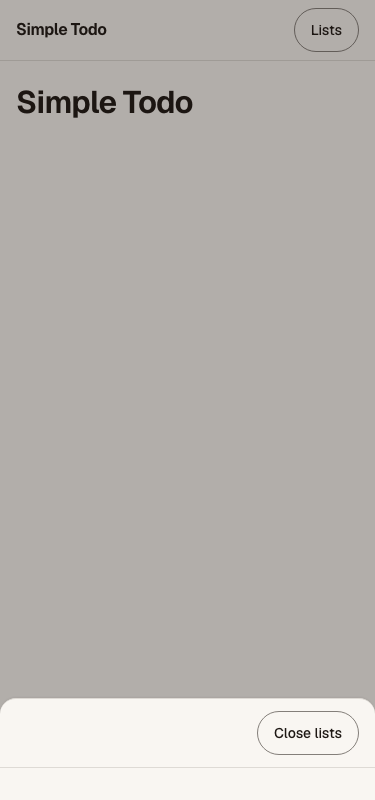

# How to build a Power Apps code app with React, Dataverse and the `pa` CLI

*A working log of building "Simple Todo", a personal task app hosted on Microsoft Power Platform.*

Last updated: 2026-09-17 · Status: **Parts 1 and 2 of 4 complete** (planning, schema, project foundation and Dataverse wiring)

---

## Overview

Power Apps **code apps** let you write an ordinary React single-page application, deploy it into a Power Platform environment, and get Microsoft Entra authentication, Dataverse access and your organisation's governance policies without building any of it yourself. You keep full control of the UI. The platform handles identity, hosting and data.

This article is the running log of building one such app end to end. The app is a personal todo list: fast capture with natural-language dates, multiple lists, due dates and reminders, recurring tasks, subtasks, and a Today view. It stores everything in three custom Dataverse tables and runs in a browser on phone, tablet and desktop.

The log is written as we go, so it records what actually happened, including the two failed imports, the environment ID that looked like a network outage, and what fixed each of them. Where a step went wrong, the fix is in Troubleshooting rather than quietly smoothed out of the procedure.

**Who this is for.** Developers comfortable with React and TypeScript who have not shipped a Power Platform app before. No low-code experience is assumed. Power Platform administrators will find the environment and permission sections useful on their own.

> **Where this build ran, and why it matters.** Everything below was done in a personal Microsoft 365 developer tenant, in a Power Platform environment with no data loss prevention policies, no environment group rules, no Managed Environment controls and no conditional access. Every setting was mine to change and every connector was available.
>
> That is not where most teams work. In a corporate tenant the same steps run into governance controls that are working exactly as intended, and the fix is a conversation with your platform team rather than a change you make yourself. The section below names each control, says where it bites, and gives you the specific ask to raise.


**What this article covers so far:**

| Part | Scope | Status |
|---|---|---|
| 1 | Specification, plan, Dataverse schema, environment setup | Complete |
| 2 | Project scaffold, design system, data layer, CLI wiring | Complete |
| 3 | Feature build: lists, tasks, capture, Today, recurrence, reminders | Not started |
| 4 | Publish, share, smoke test, and what comes after | Not started |

**A note on terminology.** Two different command-line tools sound alike. `pac` is the older .NET Power Platform CLI, distributed as an MSI on Windows and through a Visual Studio Code extension elsewhere. `pa` is the newer npm-based Power Apps CLI that became generally available in August 2026 and replaced the `pac code` command group entirely. Code apps use `pa`. Because it is an npm package, it runs anywhere Node.js does, including macOS, with no extension required. Articles written before mid-2026 will show `pac code` commands that no longer exist.

---

## Prerequisites

### Accounts and licensing

- A Microsoft 365 tenant. A Microsoft 365 developer tenant works and is what this build used.
- A **Power Apps Premium** licence for every user who will run the finished app. Developer tenants normally include enough seats for testing.
- The **System Administrator** security role on the target Power Platform environment. Importing a solution creates tables, and table creation requires it. Most developers building code apps already hold this role, so this is usually a box already ticked rather than a step. Confirm it before you start, because the failure arrives forty seconds into an import rather than up front.

  Note that this is an environment-level Dataverse role, not a tenant administrator role. The two are independent: a Microsoft 365 Global Administrator can enable code apps on an environment and still be unable to import a solution into it.

### Environment

- A Power Platform environment with Dataverse provisioned.
- **Code apps enabled** on that environment. An administrator turns this on at [admin.powerplatform.microsoft.com](https://admin.powerplatform.microsoft.com) under Manage → Environments → *your environment* → Settings → Product → Features → **Enable code apps**.

A word on which environment to use. The Default environment is shared by everyone in the tenant and is a poor home for a real app, so the conventional advice is to create a dedicated one. On a developer tenant that advice often fails: Sandbox and Production environments draw on tenant capacity, and a developer tenant rarely has the 1 GB free to spare. A **Developer** type environment is the usual workaround, since it carries its own capacity, but apps in a Developer environment cannot be shared with other users. This build stayed in the Default environment for that reason.

### Working in a governed tenant

In a developer tenant you are the administrator and nothing stands in your way. In a corporate tenant, several controls sit between you and a running code app. None of them is a defect. They exist to keep data where it belongs, and the delay they introduce is usually the approval, not the technical change.

In the OPS these requests go to **AccelerateON**, the enterprise service that manages Microsoft Power Platform and delivers robotic process automation. Raise them early, in parallel with writing your specification, rather than discovering them on the day you first try to deploy.

AccelerateON is also worth talking to before you commit to a code app at all. Part of the service's purpose is bringing automation to the OPS, and a good deal of what people reach for a custom React app to do is already solved by a canvas app, a Power Automate flow, or an existing solution in the service catalogue. A code app is the right answer when you genuinely need custom UI, custom logic or a component model that low code cannot express. It is the wrong answer when it is chosen out of unfamiliarity with what the platform already offers, and that choice carries a maintenance cost the team inherits.

| Control | Where it stops you | What to ask for |
|---|---|---|
| **Code apps not enabled on the environment** | The very first `pa app init`, and every import. It is an explicit per-environment toggle that defaults to off | Code apps enabled on the named environment. At scale this is set through environment groups and rules rather than per environment, so the answer may be "your environment needs to move groups" |
| **Environment creation restricted** | You cannot create a dedicated environment and are pushed towards a shared or Default one | A dedicated environment for the project, with Dataverse provisioned. Name the purpose and expected data. Ask for Sandbox for development with a path to Production |
| **Data loss prevention (DLP) policy** | Enforced when the app launches, not when you write the code. An app built against a blocked connector will pass every local test and fail for real users | The connectors your app needs classified as business data in the policy that applies to your environment. Dataverse is usually already allowed; anything beyond it is the risk. Ask before you build the integration, not after |
| **Managed Environment controls** | Sharing limits cap how many users you can share with, and solution checker enforcement can block a publish outright | Your app added to any exemption that applies, or confirmation of the sharing limit so you plan rollout around it. Code apps follow canvas app sharing rules |
| **Conditional Access** | Sign-in fails for users on unmanaged devices or from certain locations, often only for some of your testers | Confirmation of which policies apply to Power Platform, so you test with an account inside the policy rather than debugging a phantom auth bug |
| **Tenant isolation** | Guest and cross-tenant users cannot open the app | An exception, or a decision that external access is out of scope |
| **Power Apps licensing** | Every end user needs a Power Apps Per User licence to run a code app. Microsoft documentation calls this Power Apps Premium; in the OPS it is known by the older name. Licence procurement is usually slower than the build | Licences for your pilot group, requested at the start. This is the single most common reason a finished app sits unused |
| **Power Automate licensing** | A flow that runs outside the app, on a schedule or from an external trigger, is not covered by the app's licence. Nor are premium connectors | Power Automate Premium for the flow owner, where the flow runs standalone or touches a premium connector. Confirm scope with AccelerateON before you design around a flow |
| **Entra app registration for automated deployment** | Publishing from a pipeline needs a service principal, and creating app registrations is almost always restricted | A service principal with the environment access it needs, plus `edit` access on the app once it exists. Only needed for CI/CD, so it can follow the first manual deploy |
| **Publisher prefix and solution naming** | Not a blocker, but a rename later means recreating tables | The organisation's naming convention for publishers and solutions, before you generate anything |

The line between the two licences catches people out. A flow that runs inside an app's context can be covered by the app's own licensing, but the moment the same flow runs on a schedule, responds to an external event, or reaches a premium connector, it needs Power Automate Premium in its own right. That is the situation for the reminder flow planned for phase two of this project: it runs on a schedule regardless of whether anyone has the app open, so it sits outside the app's licence. Licensing terms change, so treat this as the question to ask rather than the answer.

Two related limitations are worth knowing early, because they are platform behaviour rather than policy and no approval will lift them. Code apps do not yet support Secure Implicit Connections, so each user consents to connections themselves. And code app assets are served from a public endpoint that does not honour the storage SAS IP restriction setting, which means IP-based restriction has to be done with Conditional Access location policies instead. If your security team asks how the app is restricted by network, that is the honest answer.

### Local tooling

- Node.js LTS. Version 24 was used here.
- Git.
- About 250 MB of disk for the Playwright browsers used by the end-to-end tests.
- Python 3, only if you want to regenerate the Dataverse schema package. Any tool that can produce a zip would do.
- The `pa` CLI, installed globally or invoked through `npx`:

```bash
npm install --global @microsoft/power-apps-cli
```

Verify it:

```bash
pa --version
```

At the time of writing this reports `1.0.2`.

---

## Procedure

### Part 1 · Planning and the data layer

#### Step 1: Write the specification before any code

The temptation with a familiar app shape like a todo list is to start typing. Resist it. A todo list is deceptively underspecified: does completing a recurring task create the next one immediately or on a schedule? Does completing every subtask complete the parent? Is "sync" a websocket or a refetch? Each of those is a fork in the implementation, and picking wrong costs a rewrite.

The specification for this build covers six areas, which is a useful minimum for any project:

1. **Objective** — what is being built, for whom, and what success looks like in measurable terms.
2. **Tech stack** — every dependency with a version and a one-line justification.
3. **Commands** — the full executable command for build, test, lint, dev and deploy. Not "run the tests" but the exact string.
4. **Project structure** — where each kind of file lives.
5. **Code style** — one real code sample beats three paragraphs of description.
6. **Boundaries** — three tiers: always do, ask first, never do.

Two techniques mattered more than the template.

**Surface assumptions explicitly and make them a numbered table.** Ten assumptions were listed before a line of the spec was written, each with a reason it mattered. Several were wrong in interesting ways, and finding that out took one exchange rather than a week of building. The most consequential: the brief asked for push notifications, and code apps have no push channel. Naming the gap early turned it into a scoped decision (browser notifications while the tab is open, with an Outlook flow deferred to a later phase) instead of a late surprise.

**Reframe vague requirements as testable criteria.** "Fast task capture" became: pressing `n` focuses an input within 100 ms, Enter saves optimistically, and typing `Buy milk on Friday` produces a task titled "Buy milk" due next Friday. That is something you can write a test against. "Fast" is not.

The result lives at [`SPEC.md`](../SPEC.md) in the repository root, in version control alongside the code, updated in the same pull request whenever a decision changes.

#### Step 2: Break the specification into ordered, verifiable tasks

The plan slices the work **vertically**. Rather than building all the data access, then all the UI, each task after the foundation delivers one complete user-visible capability: the schema it needs, the data calls, the components and the tests. Every task leaves the application in a working state.

Seventeen tasks were produced, each with acceptance criteria, a verification command, its dependencies and the files it is expected to touch. Any task that would touch more than about five files was split.

The single most valuable structural decision in the plan was a **repository interface** sitting between the application and Dataverse:

```
src/data/repo.ts          ← the contract: ListRepo, TaskRepo, SubtaskRepo
src/data/mock/            ← in-memory implementation
src/data/dataverse/       ← the real implementation over generated services
```

Because every component talks to the interface and never to Dataverse directly, fifteen of the seventeen tasks can be built and tested with no tenant connection at all. Only the wiring task and the publish task need the real environment. That decoupling also keeps Dataverse column names such as `cb_duedate` out of the React components entirely.

The plan and task list are at [`tasks/plan.md`](../tasks/plan.md) and [`tasks/todo.md`](../tasks/todo.md).

#### Step 3: Define the Dataverse schema as code

Dataverse tables are normally created by clicking through the maker portal. That works, but the schema then exists only in the tenant. It cannot be diffed, reviewed in a pull request, or recreated in a second environment without repeating every click.

The alternative is to author an **unmanaged solution package** and import it. A solution package is a zip containing three XML files:

```
solution.xml          → manifest: name, version, publisher, root components
customizations.xml    → the actual schema: entities, attributes, relationships, roles
[Content_Types].xml   → a fixed boilerplate file
```

In this build a Python script, [`solution/generate.py`](../solution/generate.py), emits all three and zips them. The script is the schema of record; the zip is a build artifact. Changing a column means editing a Python function and regenerating, which produces a readable diff.

The schema itself is three user-owned tables:

| Table | Purpose | Notable columns |
|---|---|---|
| `cb_todolist` | A bucket such as Work or Groceries | `cb_isinbox`, `cb_sortorder` |
| `cb_todotask` | A task in a list | `cb_duedate`, `cb_hastime`, `cb_recurrence`, `cb_reminderat` |
| `cb_todosubtask` | A checklist step inside a task | `cb_isdone`, `cb_sortorder` |

Plus three relationships and a `Todo User` security role granting user-level create, read, write and delete on all three.

Four details are easy to get wrong when hand-authoring the XML.

**Lookups are defined as relationships, not as columns.** You do not write a lookup attribute. You write an `EntityRelationship` of type `OneToMany` with a `<field>` element, and Dataverse creates the lookup column on the referencing table from it.

**Choice values carry the publisher's option-value prefix.** With a prefix of `10000`, the four recurrence options are 100000000 through 100000003 rather than 0 through 3. The application maps them to a plain string union at the data boundary so the rest of the code never sees the numbers.

**Element order inside an attribute is not free.** Dataverse expects `<Type>` first, then names and flags, then the type-specific elements such as `<Format>` or `<optionset>`. Putting the type-specific block immediately after `<Type>`, which reads more naturally, is rejected.

**Relationship roles are asymmetric.** This one cost an import. Details in Troubleshooting.

Choose your publisher prefix before generating anything. Every schema name is built from it, and renaming afterwards means recreating the tables. This build used `cb` and a dedicated publisher rather than one of the two defaults that ship with a tenant, whose prefixes are auto-generated strings like `cr04d74`.

#### Step 4: Import the solution

1. Open [make.powerapps.com](https://make.powerapps.com) and select the target environment in the picker at the top right. Getting this wrong imports into the wrong environment, and nothing later will warn you.
2. Choose **Solutions** in the left navigation, then **Import solution**.
3. Browse to the generated zip and continue.
4. Confirm the details page shows the expected solution name, version and publisher, then choose **Import**.
5. Wait for the success banner. A three-table import takes roughly forty seconds.

> **Screenshot placeholder** — `docs/images/import-solution.png`: the Import solution dialog with the package selected and the publisher shown.

If it fails, download the log file from the failure banner before doing anything else. It is an Excel-format XML file with two sheets: a summary with the first fatal error, and a component-by-component list showing exactly which component failed and which were never reached. It is far more useful than the message in the browser.

#### Step 5: Assign the security role

Importing the role does not assign it. In the admin center, open the environment, then Users, select the user, then Manage security roles, and tick the role. Repeat for any test accounts.

Note that a System Administrator already holds every privilege the custom role grants, so assigning it to yourself changes nothing functionally. It matters for verifying that a user with *only* the app's role can run the finished app, which is the honest test of whether your role definition is complete.

### Part 2 · Project, design system and data layer

Part 2 turns the plan into a running application skeleton: a React project with its test tooling, a design system enforced by tests, a repository layer that the whole UI will depend on, and a verified connection to the Dataverse tables from Part 1. No features ship yet. What ships is the foundation every later task stands on, and a proof that it reaches real data.

#### Step 6: Scaffold the project from the official template

Microsoft publishes a Vite template for code apps. It is a standard React and TypeScript setup plus one addition that matters, the `@microsoft/power-apps-vite` plugin, which lets the Power Apps host load your local dev server.

```bash
npx degit github:microsoft/PowerAppsCodeApps/templates/vite .
npm install
```

That command expects an empty directory, and `degit` will not write into one that already has files. This repository already held the specification and docs, so the template was fetched into a scratch folder and only the files the app needs were copied across: `index.html`, `package.json`, the three `tsconfig` files, `eslint.config.js`, `vite.config.ts`, `src/main.tsx` and `public/vite.svg`. The template's demo component, its README and its two stylesheets stayed behind. The stylesheets contain raw colour values, and in this project colours live in exactly one file, which does not exist until Step 7.

In September 2026, `npm install` resolved React 19.3, Vite 7.3, `@microsoft/power-apps` 1.4.0 and `@microsoft/power-apps-vite` 1.0.13, all newer than the ranges in the template. Expect the same drift.

The template ships with no tests, so add them before the first line of application code:

```bash
npm install -D vitest @vitest/coverage-v8 jsdom @testing-library/react @testing-library/jest-dom @testing-library/user-event @playwright/test prettier eslint-config-prettier
npx playwright install chromium webkit
```

The Playwright browsers are a separate download of roughly 250 MB. The configuration in this build runs every end-to-end spec twice, once in desktop Chromium and once in an iPhone 13 WebKit profile, because a code app on a phone is a mobile browser and nothing else.

Three configuration details are worth copying.

**Give Vitest its own config file.** `vitest.config.ts` includes the React plugin but not `powerApps()`. Tests have no Power Apps host to talk to and do not need the plugin's bootstrap.

**Declare the path alias twice.** An `@/` import alias for `src/` goes in `resolve.alias` for Vite and Vitest, and again in `paths` in `tsconfig.app.json` for the type checker. Either one alone gives you code that runs but does not typecheck, or the reverse.

**Make the four checks the definition of done.** The npm scripts are `lint` (ESLint with `--max-warnings 0`), `typecheck`, `test` and `build`, and a GitHub Actions workflow at `.github/workflows/ci.yml` runs all four on every pull request and push to `main`.

Until the code app is initialised in Step 9, every dev server start prints an error from the Power Apps plugin about a missing `power.config.json`. It is harmless. See Troubleshooting.

#### Step 7: Build the design foundation

A code app has no component library unless you add one, which is freedom and also a trap: without a system, every component invents its own colours and spacing. This build uses a small token system and lets a test enforce it.

**Tokens live in one file.** `src/styles/tokens.css` defines every colour, font, type size, spacing step, radius, easing and duration as a CSS custom property. Components reference them by name, `var(--color-accent)`, and never contain a colour value or a font name of their own. The theme here is warm-grey paper with one coral accent and Geist throughout; the reasoning and the full palette are in [`docs/design/theme.md`](design/theme.md).

**A test enforces the rule.** `src/styles/tokens.node.test.ts` walks `src/` and fails if a hex, `oklch()`, `rgb()` or `hsl()` value, or a `font-family` that is not a `var()`, appears anywhere except `tokens.css`. Review misses these. A test does not. Before trusting a guard test like this, plant a violation and watch it fail; that is how this build found its own regex was wrong (see Troubleshooting).

The test reads files with `node:fs`, which needs Node's type definitions, and the application's TypeScript config deliberately has none: browser code should not compile against Node globals. The solution is a naming convention. Files ending `.node.test.ts` are excluded from `tsconfig.app.json` and included in `tsconfig.node.json`, so each file is typechecked against the environment it actually runs in.

**Self-host the fonts.** A Google Fonts `<link>` is the usual way to load a web font, but a code app runs inside the Power Apps player, and the player's content security policy is not yours to set. Fontsource packages bundle the font files into your build so they load from the app's own origin:

```bash
npm install @fontsource-variable/geist @fontsource-variable/geist-mono
```

Note that the family name these packages register is `"Geist Variable"`, not `"Geist"`.

**Check contrast with numbers, not eyes.** Every text and border token was converted from OKLCH to sRGB and its WCAG contrast ratio computed. Two failed and were changed. White text on the coral fill came out at 3.8:1, below the 4.5:1 minimum, so the accent was darkened to `oklch(56% 0.17 35)` for 4.9:1. Control borders were 1.9:1, below the 3:1 required for component boundaries, so they were darkened to `oklch(60% 0.01 70)`.

**The app shell.** Below 768 px, the list sidebar is a bottom sheet behind a **Lists** button; from 768 px it is a permanent side rail. The same markup does both jobs. The closed sheet is hidden with `visibility: hidden` as well as a transform, which removes it from the tab order and from screen readers without any JavaScript media queries. It closes on Escape, on the backdrop and from its own close button, and returns focus to the button that opened it.

An end-to-end spec, `e2e/shell.spec.ts`, asserts there is no horizontal scroll at 320, 375, 414, 768, 1024 and 1440 px, and can save a screenshot at each width:

```bash
SHELL_SCREENSHOTS=1 npx playwright test e2e/shell.spec.ts --project desktop-chromium
```



#### Step 8: Put a repository layer between the app and Dataverse

This is the step that pays for itself for the rest of the build. Components never call Dataverse. They call three interfaces, and two implementations sit behind them.

`src/data/repo.ts` defines the domain types and the contracts. The types are shaped for the application, not for the database: a task's due date is a `Date | null`, not a `cb_duedate` ISO string, and its recurrence is `"weekly"`, not `100000002`.

```ts
export interface TaskRepo {
  getByList(listId: string): Promise<Task[]>;
  getOpenDueBefore(end: Date): Promise<Task[]>;
  create(input: NewTask): Promise<Task>;
  update(id: string, patch: TaskPatch): Promise<Task>;
  delete(id: string): Promise<void>;
}
```

The first implementation is in memory, in `src/data/mock/`, seeded with sample lists and tasks whose dates are relative to today so that there is always something overdue and something due. It powers local development and every test, which is why most of this app can be built with no tenant connection at all.

**Write the shared behaviour once, as a function.** `src/data/repoContract.ts` exports `runRepoContract(name, makeRepos)`, a suite of eighteen cases that any implementation must pass. It lives in an ordinary module rather than a `.test.ts` file because importing one test file from another registers its tests twice. The in-memory repositories run it now; the Dataverse repositories run the identical suite in Step 10.

**Make the fake as strict as the real thing.** The contract includes Dataverse's cascade behaviour from the Part 1 schema: deleting a list deletes its tasks, and deleting a task deletes its subtasks. The in-memory repositories also copy every object in and out, including `Date` objects. Without that, a component that mutated a task it had been given would silently change the "database", and the bug would only appear against Dataverse.

**Choose the implementation at startup.** `npm run dev` runs `vite --mode mock`, which loads a committed `.env.mock` file containing `VITE_USE_MOCKS=true`. `src/data/createRepos.ts` reads that flag and returns the in-memory or the Dataverse repositories. The file holds no secrets, and it has to be explicitly un-ignored if your `.gitignore` excludes `.env.*`, as this one does.

**Optimistic updates, with rollback.** TanStack Query hooks in `src/data/queries.ts` wrap every read and write. A mutation cancels in-flight fetches, snapshots every cached query under a key prefix such as `["tasks"]`, rewrites them all, and restores the snapshot if the write fails. Rewriting every task cache rather than only the current list means a task completed from the Today view is also completed in its own list. When the write settles, the prefix is invalidated and refetched, so the server always has the final word.

To test optimism, hold the repository call open. A small `deferred()` helper returns a promise the test settles by hand: the test fires the mutation, asserts the cache has already changed while the mutation is still pending, then rejects the promise and asserts the rollback.

Finally, a second guard test, `src/data/boundaries.node.test.ts`, fails if anything outside `src/data/` imports from `src/generated/`. The generated code does not exist yet. The rule is in place before it does.

#### Step 9: Initialise the code app and add the Dataverse tables

Now the project meets the environment. Sign in first. The command opens the system browser and prints the account when it finishes:

```bash
npx @microsoft/power-apps-cli auth login
```

```
Signed in as <you>@<tenant>.onmicrosoft.com.
```

Then initialise the app. **Use the environment ID exactly as the admin center shows it.** For a tenant's Default environment, that ID begins with `Default-`, followed by a GUID that is the tenant ID. Passing the bare GUID fails with a DNS error that looks like a network fault; see Troubleshooting.

```bash
npx @microsoft/power-apps-cli app init --display-name "Simple Todo" --environment-id Default-<tenant-id>
```

```
Created power.config.json for Simple Todo.
```

Initialising is local. It writes `power.config.json` with `"appId": null` and a `localAppUrl` of `http://localhost:3000`, and nothing appears in the environment until the app is first published. It also adds `@microsoft/power-apps-cli` to your `devDependencies`, pinned to the version you ran, so run `npm install` afterwards to bring the lockfile up to date. From then on, `npx pa` runs the project's copy.

Add each table by its logical name:

```bash
npx pa app add data-source --connector dataverse --table cb_todolist
npx pa app add data-source --connector dataverse --table cb_todotask
npx pa app add data-source --connector dataverse --table cb_todosubtask
```

Each command asks for the Dataverse organisation URL:

```
◆  Please provide the organization URL:
```

Find it at [make.powerapps.com](https://make.powerapps.com), with the environment selected, under **Settings → Session details → Instance url**. It has the form `https://org<id>.crm.dynamics.com/`. Pass `--org-url` to skip the prompt. Each successful run prints `Data source added successfully.`

The command reads each table's schema and generates code:

```
src/generated/models/Cb_todotasksModel.ts     → row types and choice values
src/generated/services/Cb_todotasksService.ts → create, get, getAll, update, delete
.power/schemas/                               → table schemas the services import
```

**Commit `.power/` along with `src/generated/`.** The generated services import `.power/schemas/appschemas/dataSourcesInfo.ts`, so a clone without it does not build. Exclude both folders from ESLint and Prettier, and never edit either by hand. To regenerate after a schema change, refresh by **data source name**, which is the entity set name without the prefix, as listed in `power.config.json`:

```bash
npx pa app refresh data-source --name todotasks
```

#### Step 10: Implement the Dataverse repositories

Read the generated models before writing any mapping code. They answer most of the questions the documentation leaves open:

- Lookups are **written** through a key named after the relationship, not the column: `"cb_todolist_cb_todotask_list@odata.bind": "/cb_todolists(<guid>)"`.
- Lookups are **read** back as `_cb_list_value`.
- Choice columns are typed as their integer values, `100000000` to `100000003`.
- `statecode` is required when creating a record.
- Dates are ISO strings.

All translation between those rows and the domain types lives in `src/data/dataverse/mappers.ts`, and nowhere else:

```ts
export function taskPatchRecord(patch: TaskPatch): TaskPatchRecord {
  const p = definedOnly(patch);
  const record: TaskPatchRecord = {};
  if (p.listId !== undefined) record[LIST_BIND] = `/cb_todolists(${odataId(p.listId)})`;
  if (p.isCompleted !== undefined) record.cb_iscompleted = p.isCompleted;
  if (p.completedOn !== undefined) record.cb_completedon = isoOrNull(p.completedOn);
  // …one line per column
  return record;
}
```

The repositories in `src/data/dataverse/dataverseRepos.ts` follow five rules.

1. **Always pass `select`.** Every read names its columns. Microsoft's guidance is explicit about this, and it keeps payloads small.
2. **Send only changed columns on update.** Sending unchanged values can trigger business logic and pollutes the audit history. The patch mapper above emits a column only when the patch contains it.
3. **Check results; don't expect exceptions.** Generated service calls return an `IOperationResult` with `success`, `data`, `error` and, for lists, `skipToken`. A failed call can resolve rather than reject. Each repository method checks `success` and throws `error`, and list reads follow `skipToken` until every page is loaded.
4. **Read back after writing.** After each create and update, the repository reads the record again with an explicit `select`. That guarantees lookup columns such as `_cb_list_value` are present whatever the write response contains, at the cost of one extra request per write. The optimistic UI hides the latency.
5. **Validate IDs before they reach a query.** Every ID is checked against a GUID pattern before it goes into a filter or a bind path. An ID can then never change the meaning of an OData filter.

Two details of the generated code need handling. The generated update types allow a column to be omitted but not set to `null`, and `null` is how Dataverse clears a date; the repository casts at that single call. And the generated `delete` returns `void` and discards the operation result, so a delete that reports failure without rejecting will not be noticed. There is no workaround short of editing generated code, so it is recorded as a known gap.

**Test against a strict fake of the generated services.** The repositories take the services as a parameter. In tests they receive `createFakeDataverse()`, an in-memory stand-in that is deliberately unforgiving: reads without `select` throw, filter shapes the repositories are not meant to send throw, lookups must arrive as valid binds, and deletes cascade as the real relationships do. The Dataverse repositories then run the same eighteen-case contract as the in-memory ones from Step 8, plus tests of the exact filter strings, the changed-columns rule, paging, and error handling.

#### Step 11: Prove it against the real environment in Local Play

Tests against a fake prove the code does what you think Dataverse wants. Only Dataverse proves Dataverse wants it. Three things in this build could only be confirmed for real: that the relationship-named bind keys work, that the player's connection works from a local dev server, and that the lookup column reads back.

**You do not need `pa app run` for this.** The Power Apps Vite plugin serves `power.config.json` from the dev server and prints a Local Play URL itself. Start Vite without mocks, on the port that `power.config.json` expects:

```bash
npm run dev:dataverse
```

```
  Power Apps Vite Plugin

  ➜  Local Play:   https://apps.powerapps.com/play/e/Default-<tenant-id>/a/local?_localAppUrl=http://localhost:3000/&_localConnectionUrl=http://localhost:3000/__vite_powerapps_plugin__/power.config.json
```

Open that URL in the browser profile that is signed in to the tenant. The player supplies real authentication and a real Dataverse connection, and your code talks to real tables.

**What Local Play is, and what it is not.** The URL explains it. Where a published app has its app ID, this one has `/a/local`, and `_localAppUrl=http://localhost:3000/` tells the player to fetch the app's code from the dev server on your machine. Four consequences follow:

- The URL works only while your dev server is running, and only on the machine it runs on. Sending it to a colleague achieves nothing.
- Nothing is registered in the environment. `power.config.json` still says `"appId": null`, and the app appears in neither the **Apps** list nor your solution.
- The data is not simulated. Every create, update and delete lands in the real tables, which is the point of the exercise.
- The app becomes a real, shareable app only when you publish it with `pa app push`. Publishing also gives `appId` a value. To have the app land inside your solution alongside the tables, pass the solution's ID; `pa solution list` shows it:

  ```bash
  npx pa solution list
  npx pa app push --solution-id <solution-id>
  ```

  Part 4 covers publishing and sharing.

At this stage there is no list or task UI to click; that arrives in Part 3. So the check was run through a small development-only panel that exercises the same repository code the app will use. `npm run dev:smoke` starts the same server in a mode that shows the panel, which steps through five operations and logs each result:

1. Create a list.
2. Create a task in that list, binding the lookup.
3. Mark the task complete.
4. Delete the task.
5. Delete the list.

> **Screenshot placeholder** — `docs/images/local-play-smoke.png`: the smoke panel in Local Play after all five steps, with the log visible.

All five passed on the first run. The logged task ID was reported back in the correct list, which confirmed the bind key and the lookup read in one step. The one surprise: Dataverse stored the completion time to the second. The app sent a timestamp with milliseconds, and it read back as `2026-09-17T12:45:11.000Z`. Nothing in this app depends on milliseconds, but a sort that does would need to know. The full record is in [`docs/smoke.md`](smoke.md).

### Part 3 · Features

> **Build notes, to be written up in task 17.**

#### Task 5 notes: lists

- **Hash routing, not browser routing.** `react-router` v7 in declarative mode, with `<HashRouter>` in `main.tsx`. A published code app is served from a fixed file URL inside the Power Apps player, and nothing rewrites `/list/abc` back to `index.html`, so a reload on a path URL would 404. Hash URLs (`#/list/abc`) never reach the server. `App` takes no router of its own, so tests wrap it in `<MemoryRouter>`.
- **Creating the Inbox exactly once.** React StrictMode runs effects twice in development, and two users of the Inbox can mount at the same time. `ensureInbox(repo)` in `src/features/lists/ensureInbox.ts` keeps the in-flight promise in a `WeakMap` keyed by repository, so concurrent calls share one `getAll` and one `create`. The entry is removed when the promise settles, so a failed attempt can be retried. `useInbox()` wraps it in a single TanStack Query with `staleTime: Infinity`. Across page loads, Dataverse is the guard: the next load finds the Inbox and creates nothing.
- **Deleting a list without losing tasks.** Dataverse cascades the delete to the tasks (Part 1), so "Move to Inbox" has to reparent every task first. `deleteList` moves them one at a time and deletes the list only after every move succeeds. If a move fails, the list survives and nothing is lost; any tasks already moved are safely in the Inbox.
- **Open-task counts reuse the per-list task caches** through `useQueries`, one query per list, rather than a new repository method. Later task mutations update the counts with no extra work. The cost is one request per list on first load, which is fine at personal-list scale.
- **Reordering writes only what changed.** `reorderLists` renumbers the visible lists 0, 1, 2… and returns only the lists whose `sortOrder` moved, so dragging one list past its neighbour sends two `PATCH` requests, not one per list.
- **Automated browsers do not fire native drag and drop.** A scripted mouse drag in Chromium DevTools or Playwright does not produce HTML5 `dragstart`/`drop` events. The component test drives the drop with `fireEvent.dragStart`/`dragOver`/`drop`, and the up/down buttons in edit mode give keyboard and touch users the same result.

---

## Verify

### After Part 1

Work through these before moving on to the application build.

**The solution imported completely.** Open the solution in the maker portal. You should see all three tables and the security role listed as components. A partially imported solution shows some components and no error, which is why the count matters.

**The relationships exist.** Open the task table, then its Relationships tab. Confirm each expected relationship is present and that its behaviour is right: parental where deleting the parent should delete the children, referential where it should not.

**The role grants what you intended.** Open the role and confirm the privileges are set to user level, the innermost quarter-circle, on each table. Organisation level here would let every user read everyone else's tasks.

**Data can actually be written.** In the maker portal, open the list table, choose the Data tab, and create a row by hand. If that succeeds, the schema and your permissions are both working. Delete the row afterwards.

**The CLI can authenticate.** Run `pa auth login`, which opens a browser, then:

```bash
pa auth status
pa app list
```

The second command confirms the CLI can reach the environment. An empty list is the correct result before anything has been published.

### After Part 2

**The four checks pass.** From the repository root:

```bash
npm run lint
npm run typecheck
npm test
npm run build
```

Lint must report zero warnings, not merely zero errors.

**Coverage meets the gate.** `npm run test:coverage` fails if line coverage drops below 90 % in `src/data` or 70 % overall. At the end of Part 2, `src/data` was at 100 %.

**The shell holds at every width.** `npm run e2e` runs the shell spec in desktop Chromium and iPhone 13 WebKit. Every width must report zero horizontal overflow.

**The guard tests bite.** Temporarily add `color: #f00` to any component stylesheet, or an import from `@/generated/` to any file outside `src/data/`, and run `npm test`. The token or boundary test must fail and name the file. Remove the change afterwards.

**The generated code is untouched.** `git status` should show no changes under `src/generated/`, `.power/` or `power.config.json` that you did not make through the CLI.

**Real data flows.** Run `npm run dev:smoke`, open the Local Play URL, and step through the panel. Each step should log a result, and between steps the rows should appear, change and disappear in the maker portal under **Tables → Todo Lists → Data** and **Tables → Todo Tasks → Data**.

---

## Troubleshooting

### Import fails with `SecLib::CheckPrivilege failed ... PrivilegeName: prvCreateEntity`

**Cause.** Your account lacks the System Administrator role on this environment, so it cannot create tables. Most developers already hold the role and never see this. It typically appears on a Default environment, or on one created by somebody else, where membership was never granted explicitly. Enabling code apps does not help: that is a tenant-level toggle and grants nothing inside the environment's own security model.

**Fix.** Assign yourself System Administrator on the environment, then import again. The documented path is the admin center, then the environment, then Access → Users → Manage security roles.

If that page offers no way to change roles, look for **Membership** on the environment instead. The Users path can be unavailable to an account that is not already an environment administrator, which is circular; Membership is where the control lives in the current portal and worked in this build when the Users page did not.

If neither is available, you are not an administrator of that environment and someone who is must grant it. On a developer tenant that is usually the account you signed up with.

### Import fails with `The NavPaneDisplayOption attribute is required for the Referencing Role`

**Cause.** The two `EntityRelationshipRole` elements in a one-to-many relationship are not interchangeable, and the naming is counterintuitive. Role type **1** is the referencing role. It carries the three navigation-pane elements and its navigation property is the *relationship* name. Role type **0** is the referenced role, and its navigation property is the *lookup column* name. Swapping them produces this error.

Correct form:

```xml
<EntityRelationshipRoles>
  <EntityRelationshipRole>
    <NavPaneDisplayOption>UseCollectionName</NavPaneDisplayOption>
    <NavPaneArea>Details</NavPaneArea>
    <NavPaneOrder>10000</NavPaneOrder>
    <NavigationPropertyName>cb_todolist_cb_todotask_list</NavigationPropertyName>
    <RelationshipRoleType>1</RelationshipRoleType>
  </EntityRelationshipRole>
  <EntityRelationshipRole>
    <NavigationPropertyName>cb_List</NavigationPropertyName>
    <RelationshipRoleType>0</RelationshipRoleType>
  </EntityRelationshipRole>
</EntityRelationshipRoles>
```

**Fix.** Correct the role types, regenerate the package and import again.

### The app works locally but a connector fails for real users

**Cause.** Almost always a DLP policy. Policies are evaluated when the app launches in the environment, not when you develop against the connector locally, so a connector that works all through the build can be blocked the moment someone else opens the published app.

**Fix.** Ask the governance team which policy applies to your environment and how the connectors you use are classified. A connector in a different group from the rest of your app's connectors is the usual cause. Confirm this before building anything on a connector beyond Dataverse.

### Only some testers can sign in

**Cause.** Conditional Access, tenant isolation, or a missing Power Apps Premium licence. The symptoms overlap and none of them look like a licensing problem from the browser.

**Fix.** Check licence assignment first because it is the quickest to rule out. Then ask which Conditional Access policies apply to Power Platform. If the affected testers are guests from another tenant, tenant isolation is the likely cause and needs an explicit exception.

### A failed import left tables behind

Unmanaged solution imports are **not transactional**. The failed import above had already created all three tables and their system views before it stopped at the first relationship. The solution shows as failed while the tables exist in the environment.

This is not a problem. Re-importing the corrected package updates the existing tables in place and continues to the components that never ran. Do not delete the tables first. The component sheet in the log file tells you exactly how far the import got.

### `pa app init` fails with `DNS lookup failed - unable to resolve hostname`

The full message in this build:

```
Network request failed for GET https://dc08738656cb442582f34b2dd04d62.d8.environment.api.powerplatform.com/powerapps/environment?api-version=1&$filter=name eq 'dc087386-56cb-4425-82f3-4b2dd04d62d8'. DNS lookup failed - unable to resolve hostname. Details: getaddrinfo ENOTFOUND dc08738656cb442582f34b2dd04d62.d8.environment.api.powerplatform.com
  → Check your network connection, VPN/proxy, and that the target service is reachable.
```

**Cause.** Not the network. The CLI builds an API hostname from the environment ID, and the ID passed was wrong. A tenant's Default environment has the ID `Default-<tenant-id>`; the GUID on its own is the tenant ID, and no hostname exists for it. The admin center shows the environment name and the GUID close together, which makes the mistake easy.

**Fix.** Pass the full ID, including the `Default-` prefix. A failed init writes nothing, so simply run it again.

### The app runs in Local Play but is not in the environment or the solution

**Cause.** Nothing has been published. A Local Play URL contains `/a/local` in place of an app ID, and the player loads the code from your local dev server through `_localAppUrl`. `pa app init` only writes `power.config.json`, where `appId` stays `null` until the first publish. The data your app writes during Local Play is real, but the app itself exists only on your machine.

**Fix.** This is expected during development. When you are ready to publish, run `npm run build`, then `npx pa app push --solution-id <solution-id>`, using the ID from `npx pa solution list`. Without `--solution-id`, the published app is not added to your solution, so look for it in the **Apps** list instead. Publishing is Part 4.

### The dev server prints `Missing file. Ensure you have run 'pac code init' first.`

```
[powerApps] Error loading power.config.json:
            ⤷Missing file. Ensure you have run 'pac code init' first. power.config.json expected at <project>/power.config.json.
```

**Cause.** The Power Apps Vite plugin runs before the code app has been initialised. The message still names `pac code init`, a command that no longer exists.

**Fix.** Nothing, until you reach Step 9. The app runs normally against the in-memory data. Once `pa app init` has written `power.config.json`, the message is replaced by the Local Play URL.

### `pa app add data-source` keeps asking for the organization URL

```
◆  Please provide the organization URL:
```

**Cause.** The CLI does not derive the Dataverse organisation URL from the environment ID, and asks once per table.

**Fix.** Enter the instance URL from **make.powerapps.com → Settings → Session details**, or pass `--org-url https://org<id>.crm.dynamics.com/` on each command.

### A test that reads CSS through `import.meta.glob` gets an empty string

Reading stylesheets with `import.meta.glob(..., { query: "?raw" })` works in Vite but not under Vitest, which stubs CSS. The test failed with:

```
TypeError: Cannot convert a Symbol value to a string
AssertionError: expected '' to contain '--color-'
```

**Fix.** Read the files with `node:fs` instead, and name the test `*.node.test.ts` so that it is typechecked with Node's types (Step 7).

### Typecheck fails with `Cannot find name '__dirname'` or `Cannot find name 'document'`

```
src/styles/tokens.test.ts(5,21): error TS2304: Cannot find name '__dirname'.
e2e/shell.spec.ts(13,52): error TS2584: Cannot find name 'document'. Do you need to change your target library? Try changing the 'lib' compiler option to include 'dom'.
```

**Cause.** Each file was typechecked against the wrong environment. The first is a Node test inside the browser config, which has no Node types. The second is a Playwright spec whose `page.evaluate` callbacks run in the browser, inside the Node config, which has no DOM library.

**Fix.** Keep Node-only tests under `tsconfig.node.json` with the `.node.test.ts` naming convention, use `import.meta.dirname` rather than `__dirname`, and add `"DOM"` to `lib` in `tsconfig.node.json` for the Playwright specs.

### A guard regex flags every valid line

The first version of the font-family check, `/font-family:\s*(?!var\()/`, reported `font-family: var(--font-body)` as a violation. `\s*` is allowed to match zero characters, so the negative lookahead is tested against ` var(` with its leading space, which does not start with `var(`, and the match succeeds.

**Fix.** Move the whitespace inside the lookahead: `/font-family:(?!\s*var\()/`. More generally, test a guard against a planted violation *and* against known-good code before relying on it.

### The dev server reloads constantly during a test run

```
[vite] (client) page reload coverage/src/data/useRepos.ts.html
```

**Cause.** Vite watches the whole project root, including the HTML report that `npm run test:coverage` writes.

**Fix.** Add the report folders to `server.watch.ignored` in `vite.config.ts`: `coverage/`, `playwright-report/` and `test-results/`.

### Lint fails with `Avoid calling setState() directly within an effect`

`eslint-plugin-react-hooks` 7 adds the `react-hooks/set-state-in-effect` rule. It flagged an effect that moved focus to a control and then cleared a "pending focus" state variable. Hold the pending target in a `useRef` instead and read it in an effect that runs after every render. The actions that request focus already change other state, so a render always follows.

### The `pa` command is not found on macOS

You are probably thinking of `pac`, which does need an MSI on Windows or the Visual Studio Code extension elsewhere. The code apps CLI is `pa`, an npm package, and installs the same way on every platform:

```bash
npm install --global @microsoft/power-apps-cli
```

Or run it without installing:

```bash
npx @microsoft/power-apps-cli --version
```

### Cannot create a new environment: 1 GB of capacity required

The tenant has no free Dataverse capacity, which is normal on a developer tenant where the Default environment has consumed it. Options, in order of preference: create a **Developer** type environment, which carries its own capacity but cannot share apps with other users; free capacity by deleting an unused environment; or work in the Default environment, which is what this build did.

### Only default publishers appear in the publisher list

A new tenant has two: a CDS default publisher and an organisation default, both with auto-generated prefixes. Neither is a good choice, because the prefix becomes part of every schema name. Create your own publisher with a short meaningful prefix, or let a solution package create one on import, which is what this build did.

> **Screenshot placeholder** — `docs/images/publisher-list.png`: the publisher dropdown showing only the two defaults on a fresh tenant.

---

## Related information

**Microsoft documentation**

- [Power Apps code apps overview](https://learn.microsoft.com/en-us/power-apps/developer/code-apps/overview) — features, prerequisites, licensing and the current limitations list
- [Quickstart: create a code app using the Power Apps CLI](https://learn.microsoft.com/en-us/power-apps/developer/code-apps/how-to/create-an-app-from-scratch)
- [Connect your code app to Dataverse](https://learn.microsoft.com/en-us/power-apps/developer/code-apps/how-to/connect-to-dataverse) — generated services, supported operations, and what is not supported
- [Power Apps CLI command reference](https://learn.microsoft.com/en-us/power-apps/developer/code-apps/reference/cli) — every `pa` command and parameter
- [Code apps architecture](https://learn.microsoft.com/en-us/power-apps/developer/code-apps/architecture)
- [Customization solutions file schema](https://learn.microsoft.com/en-us/power-apps/developer/data-platform/customization-solutions-file-schema) — the XML reference for hand-authoring a solution

**Packages**

- [`@microsoft/power-apps`](https://www.npmjs.com/package/@microsoft/power-apps) — the client library, sometimes called the Power Apps SDK
- [`@microsoft/power-apps-cli`](https://www.npmjs.com/package/@microsoft/power-apps-cli) — the `pa` CLI

**Community**

- [PowerAppsCodeApps repository](https://github.com/microsoft/PowerAppsCodeApps) — official templates and samples, including a Dataverse demo app
- [CLI general availability announcement](https://github.com/microsoft/PowerAppsCodeApps/discussions/438) — the `pac code` to `pa` migration, including renamed flags

**Governance reference**

- [Data loss prevention policies](https://learn.microsoft.com/en-us/power-platform/admin/wp-data-loss-prevention) — how connectors are grouped and how policies are evaluated
- [Environment groups and rules](https://learn.microsoft.com/en-us/power-platform/admin/environment-groups) — how code apps get enabled at scale
- [Managed Environment sharing limits](https://learn.microsoft.com/en-us/power-platform/admin/managed-environment-sharing-limits)
- [Publish a code app with a service principal](https://learn.microsoft.com/en-us/power-apps/developer/code-apps/how-to/use-service-principal) — the non-interactive deployment path

**Known limitations worth reading before you commit to code apps**

Code apps do not run in the Power Apps mobile player, so mobile means a mobile browser. They do not support Power Platform Git integration, SharePoint forms integration, or Power BI data integration, and they are not supported in Power Apps for Windows. There is no offline mode and no push notification channel. None of these blocked this project, but any one of them could block yours.

**In this repository**

- [`SPEC.md`](../SPEC.md) — the full specification
- [`tasks/plan.md`](../tasks/plan.md) and [`tasks/todo.md`](../tasks/todo.md) — implementation plan and task list
- [`docs/dataverse-setup.md`](dataverse-setup.md) — the operational runbook for the schema, including a click-by-click manual fallback
- [`solution/generate.py`](../solution/generate.py) — the schema generator
- [`docs/design/theme.md`](design/theme.md) — the design theme, palette with contrast ratios, and shell screenshots
- [`docs/smoke.md`](smoke.md) — manual checks against the real environment and their results
- [`src/data/repoContract.ts`](../src/data/repoContract.ts) — the behaviour every repository implementation must pass

---

*Part 3 is in progress as build notes. Next up: tasks and the checkmark, fast capture with natural-language dates, and the Today view.*
